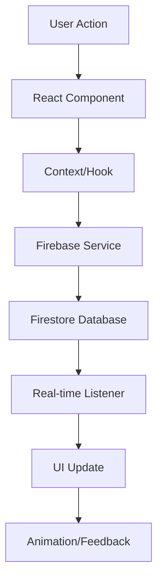

# Architecture: QuickBingo™ Online - Modern Mobile-First Multiplayer Game

## 🏗 Architectural Overview

QuickBingo™ Online is a **modern, mobile-first, real-time multiplayer Bingo game** built with cutting-edge web technologies. The architecture emphasizes performance, scalability, and exceptional user experience across all devices.

## 🛠 Technology Stack

### Core Frontend Technologies
- **React 18.3.1** - Latest React with Concurrent Features
- **TypeScript 5.5** - Type-safe development
- **Vite 5.4** - Lightning-fast build tool and dev server
- **Modern ES2022** - Latest JavaScript features

### Styling & UI Framework
- **Tailwind CSS 3.4** - Utility-first CSS framework
- **Custom CSS System** - Modern design tokens and utilities
- **Framer Motion 11** - Smooth animations and transitions
- **CSS Grid & Flexbox** - Modern layout systems
- **Material-UI 7.0** - Legacy components (being phased out)

### Mobile & PWA
- **Capacitor 6** - Native mobile app wrapper
- **PWA Support** - Progressive Web App capabilities
- **Touch Optimization** - Mobile-first interaction design
- **Safe Area Support** - Modern device compatibility

### Backend & Real-time Database
- **Firebase Firestore** - NoSQL real-time database
- **Firebase Authentication** - Secure user management
- **Firebase Cloud Functions** - Serverless backend logic
- **Firebase Hosting** - Static site hosting
- **Firebase Storage** - File and media storage

### Development & Build Tools
- **ESLint** - Code linting and style enforcement
- **PostCSS** - CSS processing and optimization
- **Autoprefixer** - CSS vendor prefixes
- **TypeScript Compiler** - Type checking and compilation

## 🏛 Architectural Layers

### 1. Presentation Layer (UI Components)
```
src/components/
├── Auth/           # Authentication components
├── Game/           # Game-specific components  
├── Lobby/          # Lobby management
└── UI/             # Reusable UI components
```

### 2. Business Logic Layer (Contexts & Hooks)
```
src/contexts/       # React Context providers
src/hooks/          # Custom React hooks
src/utils/          # Pure utility functions
```

### 3. Data Access Layer (Services)
```
src/services/       # Firebase integration
src/types/          # TypeScript definitions
```

### 4. Styling Layer (Design System)
```
src/styles/
├── tokens.css      # Design tokens (colors, spacing, typography)
└── utilities.css   # Custom utility classes
```

## 🎮 Game Architecture

### Real-time Game Flow


### Game State Management
1. **Local State** - Component-level UI state
2. **Context State** - Global app state (auth, settings, notifications)
3. **Firebase State** - Real-time game data synchronization
4. **Persistent State** - localStorage for user preferences

### Game Room Lifecycle
```typescript
interface GameRoomState {
  status: 'waiting' | 'ready' | 'playing' | 'stopping' | 'finished'
  players: Player[]
  drawnNumbers: number[]
  winner?: string
  settings: RoomSettings
}
```

## 📱 Mobile-First Architecture

### Responsive Design Strategy
- **Mobile-first CSS** - Start with mobile, enhance for larger screens
- **Touch-friendly UI** - Minimum 44px touch targets
- **Gesture support** - Swipe, pinch, tap optimizations
- **Performance focus** - Optimized for mobile hardware

### Progressive Web App (PWA) Features
- **Service Worker** - Offline caching and background sync
- **Web App Manifest** - Native app-like installation
- **Push Notifications** - Engagement and game updates
- **Background Sync** - Data synchronization when offline

### Native Mobile Integration (Capacitor)
```typescript
// Example: Native device features
import { Haptics, ImpactStyle } from '@capacitor/haptics'
import { LocalNotifications } from '@capacitor/local-notifications'

// Haptic feedback for game interactions
await Haptics.impact({ style: ImpactStyle.Medium })

// Native notifications
await LocalNotifications.schedule({
  notifications: [{
    title: 'Game Started!',
    body: 'Your Bingo game has begun',
    id: 1
  }]
})
```

## 🎨 Modern Design System

### Design Tokens Architecture
```css
/* Color System */
:root {
  --color-primary-500: #6366f1;    /* Indigo */
  --color-secondary-500: #f59e0b;  /* Amber */
  --color-success-500: #10b981;    /* Emerald */
  --color-error-500: #ef4444;      /* Red */
}

/* Spacing Scale */
:root {
  --space-1: 0.25rem;   /* 4px */
  --space-2: 0.5rem;    /* 8px */
  --space-4: 1rem;      /* 16px */
  --space-8: 2rem;      /* 32px */
}

/* Typography Scale */
:root {
  --text-sm: 0.875rem;
  --text-base: 1rem;
  --text-lg: 1.125rem;
  --text-xl: 1.25rem;
}
```

### Component Architecture
```typescript
// Modern functional component with TypeScript
interface BingoCardProps {
  numbers: number[]
  drawnNumbers: Set<number>
  onMarkNumber: (number: number) => void
  isPlayerCard: boolean
}

export const BingoCard: React.FC<BingoCardProps> = ({
  numbers,
  drawnNumbers,
  onMarkNumber,
  isPlayerCard
}) => {
  // Component logic
  return (
    <div className="grid grid-cols-5 gap-2 p-4">
      {/* Card implementation */}
    </div>
  )
}
```

## 🔄 Real-time Data Architecture

### Firebase Firestore Schema
```typescript
// Game Room Document Structure
interface GameRoom {
  id: string
  creatorUid: string
  creatorName: string
  status: GameStatus
  maxPlayers: number
  currentPlayers: Player[]
  drawnNumbers: number[]
  gameSettings: GameSettings
  createdAt: Timestamp
  updatedAt: Timestamp
}

// Real-time Listeners
const useGameRoom = (roomId: string) => {
  const [gameRoom, setGameRoom] = useState<GameRoom | null>(null)
  
  useEffect(() => {
    const unsubscribe = onSnapshot(
      doc(db, 'gameRooms', roomId),
      (doc) => setGameRoom(doc.data() as GameRoom)
    )
    return unsubscribe
  }, [roomId])
  
  return gameRoom
}
```

### State Synchronization Strategy
1. **Optimistic Updates** - Immediate UI feedback
2. **Real-time Sync** - Firebase listeners for live updates
3. **Conflict Resolution** - Server-side validation
4. **Error Recovery** - Automatic retry mechanisms

## ⚙️ Settings & Configuration Architecture

### Settings Management System
```typescript
interface SettingsState {
  // Audio & Music
  masterVolume: number
  musicVolume: number
  soundEffects: boolean
  
  // Appearance  
  theme: 'light' | 'dark' | 'auto'
  language: 'tr' | 'en'
  animations: boolean
  
  // Game Settings
  autoMarkNumbers: boolean
  showOpponentProgress: boolean
  
  // Notifications
  pushNotifications: boolean
  gameInvites: boolean
}

// Settings Context with persistence
export const SettingsProvider: React.FC = ({ children }) => {
  const [settings, setSettings] = useState<SettingsState>(defaultSettings)
  
  // Auto-save to localStorage
  useEffect(() => {
    localStorage.setItem('quickbingo-settings', JSON.stringify(settings))
  }, [settings])
  
  return (
    <SettingsContext.Provider value={{ settings, updateSetting }}>
      {children}
    </SettingsContext.Provider>
  )
}
```

## 🚀 Performance Architecture

### Code Splitting Strategy
```typescript
// Route-based code splitting
const MainLobby = lazy(() => import('./components/Lobby/MainLobby'))
const GameScreen = lazy(() => import('./components/Game/GameScreen'))

// Component-based splitting for large features
const SettingsModal = lazy(() => import('./components/UI/SettingsModal'))
```

### Bundle Optimization
- **Tree Shaking** - Remove unused code
- **Dynamic Imports** - Load features on demand
- **Asset Optimization** - Compress images and fonts
- **Service Worker Caching** - Cache static assets

### Real-time Performance
- **Firebase Connection** - Persistent WebSocket connection
- **Data Batching** - Batch multiple updates
- **Local Caching** - Cache frequently accessed data
- **Memory Management** - Cleanup listeners on unmount

## 🔒 Security Architecture

### Authentication & Authorization
```typescript
// Firebase Auth integration
export const useAuth = () => {
  const [currentUser, setCurrentUser] = useState<User | null>(null)
  
  useEffect(() => {
    const unsubscribe = onAuthStateChanged(auth, (user) => {
      setCurrentUser(user)
    })
    return unsubscribe
  }, [])
  
  return { currentUser, signIn, signOut, signUp }
}
```

### Data Security
- **Firestore Security Rules** - Server-side data validation
- **Input Sanitization** - XSS protection
- **Rate Limiting** - Prevent abuse
- **HTTPS Only** - Encrypted data transmission

## 📦 Build & Deployment Architecture

### Development Workflow
```bash
# Local development
npm run dev           # Vite dev server with HMR

# Testing
npm run test          # Jest unit tests
npm run e2e           # Cypress integration tests

# Production build
npm run build         # Optimized production bundle
npm run preview       # Preview production build
```

### Deployment Pipeline
1. **Code Push** → GitHub repository
2. **CI/CD Pipeline** → GitHub Actions
3. **Build & Test** → Automated testing
4. **Deploy Web** → Firebase Hosting
5. **Deploy Mobile** → App Store deployment

### Mobile App Build Process
```bash
# Capacitor sync
npm run build
npx cap sync

# iOS build
npx cap open ios
# Xcode → Archive → Upload to App Store

# Android build  
npx cap open android
# Android Studio → Generate Signed Bundle
```

## 🔮 Future Architecture Enhancements

### Planned Improvements
- **WebRTC Integration** - Voice chat during games
- **AI Players** - Single-player mode with bots
- **Tournament System** - Bracket-style competitions
- **Spectator Mode** - Watch games in progress
- **Replay System** - Save and replay game sessions

### Scalability Considerations
- **Database Sharding** - Distribute game rooms
- **CDN Integration** - Global asset delivery
- **Microservices** - Separate game logic services
- **Kubernetes** - Container orchestration for scaling

---

This architecture provides a solid foundation for a modern, scalable, and maintainable multiplayer gaming experience while maintaining excellent performance across all devices and platforms. 🎯🏗️